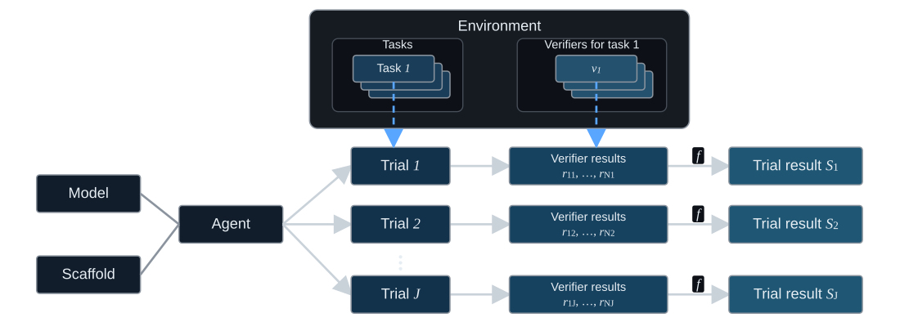

# Data format

  

> **Evaluation flow.** An environment supports one or more tasks, each associated with one or more verifiers. A model and scaffold form an agent, which may execute a selected task over repeated trials $\tau_j$. Applying verifier $v_i$ to trial $\tau_j$ produces $r_{ij}=v_i(\tau_j)$. The scoring rule $f$ maps each trial's verifier results to its trial result $S_j$.

## Terminology

| Term | Meaning |
| --- | --- |
| Model | The underlying language model |
| Scaffold | The system that turns model outputs into actions and parses environment observations (sometimes called a harness)|
| Agent | A model-scaffold pair. If a source reports a reasoning setting, such as `high`, we append it to the agent ID |
| Environment | The system with which an agent interacts, defining the states, actions, and observations available |
| Task | A given problem consisting of a string instruction (and an initial environment state) |
| Trial / rollout | One execution of one agent on one task |
| Verifier | A procedure that evaluates a trial, such as a script, LLM judge, exact-match check, or human evaluation. A verifier may internally perform multiple checks |
| Verifier result | The binary or numerical value returned by one verifier for one trial |
| Scoring rule | The rule that maps one or more verifier results to a trial result |
| Trial result | The value $S \in \{0,1\}$ assigned to a trial by the scoring rule applied on top of the verifier results |
| Record | A stored row in MESSIER containing a trial result or verifier result. Some records contain only source-reported summaries such as pass@k |

Throughout this repository, state refers to the environment state. A reasoning setting changes the agent ID, but not the model name.

## Data files

The release files use the same terminology as the paper. Names inside a metadata object preserve the upstream source's terminology and do not define additional MESSIER concepts. Column names use `snake_case`. A field ending in `_id` identifies an entity, while a field beginning with `n_` is a count. [`models.py`](../src/messier/models.py) defines the corresponding Python schemas.

**source_platform** records where the data are hosted, while **data_provider** records the collection that supplied them. For example, Agent Psychometrics results hosted on GitHub have source platform `github` and data provider `agent_psychometrics`.

| File | One row represents |
| --- | --- |
| **tasks.jsonl** | One task |
| **verifiers.jsonl** | One verifier, linked to its task |
| **records.jsonl** | One stored trial result, verifier result, or source summary |
| **trajectories.jsonl** | One available step-by-step execution trajectory (agent per task) |
| **classifications.jsonl** | One task's final SOC and NAICS labels, the labels proposed by each classification model, and adjudication details when the models disagree |
| **task_files/** | Original files available to agents for tasks that provide them |

For example, a trial with three separately reported verifier results produces four records: three verifier-result rows and one trial-result row.

### Tasks

| Field | Meaning |
| --- | --- |
| **benchmark** | Stable benchmark identifier |
| **benchmark_group** | Programming, research, enterprise, GUI, or function calling |
| **task_id** | Task identifier within the benchmark |
| **environment_id** | Identifier for the system with which the agent interacts |
| **environment_description** | Short description of that environment |
| **environment_metadata** | Structured action-space and environment-state information, described below |
| **task_description** | Instruction shown to the agent, when available |
| **task_metadata** | Source-specific task information, including extra context, described below |
| **gold_answer** | Reference answer or rubric, when included in this release |
| **task_date** | Task or benchmark release date in `YYYY-MM-DD` form |
| **verifiers** | Compact descriptions of the verifiers linked to the task. Their identifiers and full rows appear in verifiers.jsonl |
| **human** | Available estimates of human completion time or steps, described below |
| **difficulty_label** | Source-provided or derived human difficulty band |
| **source_platform** | Upstream platform on which the task data were published |
| **data_provider** | Intermediary collection that provided the task, or null for a direct source |
| **soc_code** | Standard Occupational Classification code |
| **naics_code** | North American Industry Classification System code |
| **n_records** | Number of rows in records.jsonl linked to the task |
| **n_verifiers** | Number of verifiers linked to the task in verifiers.jsonl |
| **scoring_rule** | How verifier results form the trial result |
| **mean_trial_result** | Mean of the task's non-null trial results |
| **is_saturated** | Whether all non-null trial results are 0 or all are 1 |
| **is_unrecorded** | Whether no row in records.jsonl is linked to the task |

Each task has one 2018 SOC minor group and one 2022 NAICS sector. We use exact source labels when available, as in GDPval. Three models classify every other task individually, and a fourth model resolves disagreements.

**Environment metadata** describes the action space and environment state.

| Nested field | Meaning |
| --- | --- |
| **action_space.types** | One or more of text, tool calls, shell, or UI |
| **action_space.description** | Source-specific description of what the agent can do |
| **environment_state.type** | Where the environment state exists: none, filesystem, in memory, or live web |
| **environment_state.access** | Whether the agent has no access, read-only access, or read-write access |
| **environment_state.ref** | Pinned repository revision, dataset revision, or source artifact when available |
| **environment_state.snapshot** | Source-provided information for reconstructing the state, when available |
| **url** | Source URL for the environment or task, when available |

**Task metadata** preserves source-specific information. Its common nested field is **task_metadata.extra_context**, which contains or identifies information available to the agent but absent from the initial task description, such as reference files, starter code, images, or system instructions.

| Nested field | Meaning |
| --- | --- |
| **task_metadata.extra_context** | Information available to the agent beyond the initial task description |
| **task_metadata.extra_context.input_files** | Files initially available to the agent and included in this release |
| **task_metadata.extra_context.input_files[].path** | File location in the original evaluation environment |
| **task_metadata.extra_context.input_files[].dataset_path** | File location in the MESSIER release |

Pass the input-file dataset path to `hf_hub_download` to retrieve the preserved file.

**human** estimates may include **minutes_median**, **minutes_low**, **minutes_high**, or **steps**.

**scoring_rule** has three values. Direct scoring uses one binary verifier result unchanged. All-pass scoring requires every binary verifier result to equal 1. Threshold scoring compares a numerical summary of one or more verifier results with the benchmark's threshold. Each task records its own scoring rule, so tasks from the same benchmark may use different rules.

### Verifiers

| Field | Meaning |
| --- | --- |
| **benchmark**, **task_id** | Task evaluated by the verifier |
| **verifier_id** | Verifier identifier within the benchmark |
| **description** | Description of what the verifier checks, when available |
| **verifier** | Type and available source-specific details about the procedure, described below |
| **metadata** | Additional source information |
| **gold_answer** | Verifier-specific reference answer, when available |
| **source_platform** | Upstream platform on which the verifier definition was published |
| **data_provider** | Intermediary collection that provided the verifier definition, or null for a direct source |

**Verifier details** are nested inside **verifier**.

| Nested field | Meaning |
| --- | --- |
| **verifier.type** | Script, exact match, LLM judge, or human label |
| **verifier.mode** | Final when evaluation uses the final output or environment state, sequential when it examines the interaction step by step |
| **verifier.script_code** | Source code when the source publishes a script implementation |
| **verifier.name**, **verifier.role** | Source evaluator identity and purpose, when available |

The release omits **verifier.script_code** when the source implementation is unavailable.

### Records

| Field | Meaning |
| --- | --- |
| **record_type** | `trial_result`, `verifier_result`, or `source_summary` |
| **benchmark**, **task_id** | Task to which the record belongs |
| **benchmark_group** | Programming, research, enterprise, GUI, or function calling |
| **verifier_id** | Verifier that produced a verifier result, or null for other record types |
| **agent_id** | Standardized agent identifier. A reported reasoning effort appears after the model, followed by `+scaffold` when a scaffold is identified |
| **agent_model** | Standardized name of the model in that agent |
| **model_reasoning_effort** | Enabled, low, medium, high, xhigh, max, or null when unavailable |
| **agent_scaffold** | Standardized name of the scaffold in that agent |
| **model_date** | Model release date in `YYYY-MM-DD` form |
| **trial** | Zero-based trial index within an agent-task pair. Rows from the same trial share this index. The value is null for a source summary |
| **result** | The value identified by record type |
| **metadata** | Additional source details or non-scorable error information |
| **source_platform** | Upstream platform on which the record data were published |
| **data_provider** | Intermediary collection that provided the record, or null for a direct source |

A scored trial result is 0 or 1. Non-scorable runs have a null result. A verifier result may be binary or numerical. A source summary stores an aggregate reported by the source, such as LiveCodeBench's pass@1, when individual results are unavailable. Its **result** is normalized to 0--1, **record_type** is `source_summary`, and **trial** is null.

### Trajectories

| Field | Meaning |
| --- | --- |
| **benchmark**, **task_id** | Task attempted in the trajectory |
| **agent_id**, **agent_model**, **agent_scaffold** | Agent that produced the trajectory |
| **model_reasoning_effort** | Reported reasoning setting, when available |
| **model_date** | Model release date in `YYYY-MM-DD` form |
| **trial** | Trial index shared with its result in records.jsonl |
| **content** | Complete source-provided trajectory as text |
| **metadata** | Source path and other source-specific details |
| **source_platform** | Upstream platform on which the trajectory was published |
| **data_provider** | Intermediary collection that provided the trajectory, or null for a direct source |

MESSIER includes source-provided trajectories when they are available. We preserve their internal structure because sources represent interactions differently. So it is up to the downstream user to parse this field correctly.

### Classifications

| Field | Meaning |
| --- | --- |
| **benchmark**, **task_id** | Task to which the classification belongs |
| **soc_code**, **naics_code** | Final SOC and NAICS codes attached to the task |
| **soc_source**, **naics_source** | Whether the final code comes from source metadata, a majority vote, or adjudication |
| **votes** | Each classification model's proposed codes, rationale, confidence, and model name, or null for source-provided labels |
| **adjudicator_model** | Model that resolves a disagreement, when needed |
| **adjudicator_rationale** | Explanation for the adjudicated labels, when needed |
| **adjudicator_confidence** | Whether the adjudicator reports confidence in its labels, when needed |
